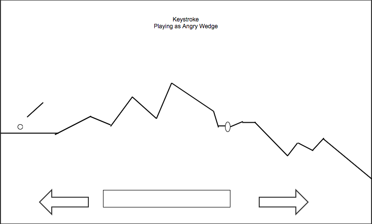

# Keystroke

A single-player golf game that tracks the player's score, awarding more points for fewer strokes. At the end of 9 holes, the player's name & score are submitted to the leaderboard.

## Rules & Functionalities
- Adjust your angle/y-velocity using the `w` or `s` keys.
- Hold down `spacebar` to add power/x-velocity and release to stroke.
- Use `a` and `d` to change directions.
- Backspin: add backspin to your stroke by holding down `b` + `spacebar` to stroke.

## Features
### Algorithmic Map Generation
- each map is generated randomly by a custom algorithm
- The fairway is laid first, then the green/hole/flag, then the water, then the sand
- The user has roughly a 10% chance of playing a similar map on the next turn
- No two maps will ever be exactly the same

### Custom physics engine
- designed to calculate bounces on a linear x-axis
- water terrain that forces you to start over from your last position
- sand terrain that enables unpredictable shoot/bounce physics to add difficulty

### Sound FX
there are various sound effects to enhance the game experience

### FirebaseDB Leaderboard
The game uses Firebase to store player names and scores in a "scores" table. The DB is read/write only and allows users to add multiple rows with the same name in typical arcade fashion.

Current DB rules are set to public which allows users to push their score to the database with no authentication. This also provides a backdoor for insidious users to manipulate the leaderboard but the scope of the game doesn't warrant protection from that.

### Scoring
There are 9 holes in total so the maximum possible score is 9000
- 1-stroke: 1000 points
- 2-strokes: 750 points
- 3-strokes: 500 points
- 4-strokes: 250 points
- 5-strokes: 100 points
- 6-strokes: 75 points
- 7-strokes: 50 points
- 8-strokes: 25 points

### Technologies Used
- HTML5 Canvas
- CSS3
- JavaScript ES6
- FirebaseDB
- jQuery

